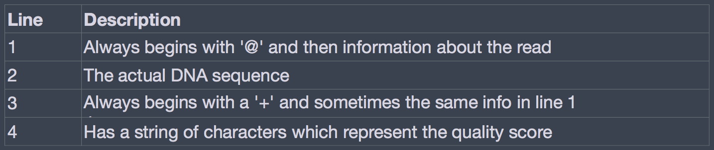
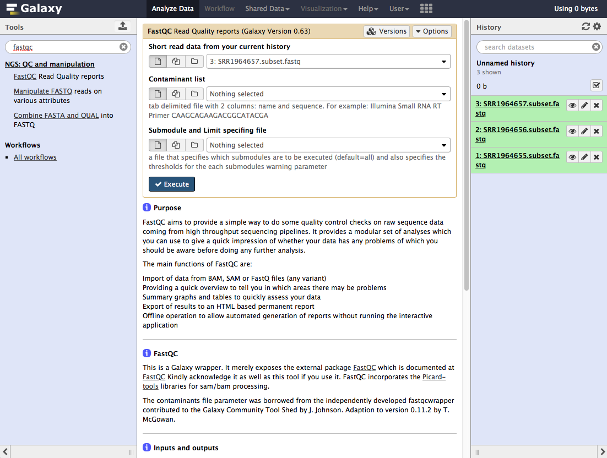

Approximate time: 4 hours

## Learning Objectives:

* Understand the theory for each step in the RNA-Seq workflow
* Become familiar with the terminology and tools used in an RNA-Seq workflow

[Galaxy](http://usegalaxy.org) is an integrated tool management system with a user-friendly graphical user interface (GUI). It is designed for running multiple bioinformatics tools on genomic data in a single point-and-click environment. In this tutorial we are going to get acquainted with Galaxy. If you are interested in learning more about the system or setting up your own copy we have provided additional links to online courses and public instances on the [resource page](/resources). 

This first session will familiarize you with the system, and we will be using the same principles during the various sequencing modules of the workshops. We’ll see how to access Galaxy from your machine, get oriented and perform some basic tasks. Because genomic data is usually very large and the bioinformatics tools which we use tend to take a very long time to execute, it is a good idea to be running the data analysis on a dedicated computer system (a compute cluster) as opposed to on your own laptop or machine. This is why in this tutorial series we will be using Galaxy running on a remote machine (“in the Cloud” using [Amazon's EC2 environment](http://aws.amazon.com/ec2/)) which has been set up for you. This environment on the Cloud will be accessible to you for the duration of this session.

## Accessing Galaxy

In order for you to be able to access Galaxy on your assigned dedicated machine on the Cloud, you have been given a web or IP address in the form of A.B.C.D where A, B, C and D are numbers separated by dots. 

You will find the current IP address at the top of our [resource page](../resources). You will need it in order to access Galaxy from the web browser on your laptop. 

## The Galaxy interface

Before we get going on an analysis, let's start with exploring what a Galaxy instance actually looks like. Open up a web browser of your choice, and enter the web or IP address given to you during the course into the Address Bar and press ENTER. You should see the main Galaxy screen as shown below. This example was run using the Google Chrome web browser. This is the main `Analyze data` window where data analysis is performed. You should see something similar to the following screenshot. 

The main page is composed of four primary sections:

1. The center page (orange) is where you will be viewing the data and entering parameter values when running tools. Now you don’t see anything because we haven’t loaded any data and we didn’t run any tools yet. 
2. The left column (blue) is where all of the tools and commands are located, grouped by major headings. You will be selecting tools from here when loading and analyzing data. 
3. The right column (green) is where a history of all the commands that were run are logged. The history is a very powerful feature of Galaxy which allows you to keep track of the steps that were undertaken from the very beginning of loading data, to the very last analysis step. We will see later on how to share your history with your collaborators and how to create workflows from them. Once again, the history is empty because we haven’t run any tools yet.  
4. The very top of the window (red) contains several menus which allow you to move away from this main `Analyze data` page. You can move from one view to another without losing any of your data. We’ll be using some of the other Galaxy functionality offered here in future tutorials. 

You should always remember **to log in to Galaxy** by clicking on the `User` menu item and `Log in` with your email address and password. If you are not already registered, take a moment to do so now. Click on the `User` menu item and `Register`  by filling out your email address, preferred password and a public name (all lowercase) by which you’d like to be identified to other users. Click `Submit` and Galaxy will automatically log you in to your new account. 

Even though it is not required to run analyses, logging in with your account lets you name and save histories, so you can come back to the analysis later from any computer. Please note that every Galaxy instance is different and this login information is only for this class; so if you use the public galaxy instance, we encourage you to create an account there as well.

## Experimental dataset
The dataset we are using is part of a larger study described in [Westermann AJ et al, Nature 2016](http://www.nature.com.ezp-prod1.hul.harvard.edu/nature/journal/v529/n7587/full/nature16547.html). In this paper the authors set out to understand the role of small regulatory RNAs (sRNAs) experssed by *Salmonella typhimurium* during host infection. Using cutting-edge RNA sequencing-based methods, the authors "*charted the dynamic RNA expression landscape of both a bacterial pathogen and its eukaryotic host during the course of infection.*"

From this study we are using the data from the 24h time point host RNA-Seq data, for the RNA-Seq tutorial. In our example analysis, our goal is to understand the gene expression differences in host expression between the infected (GFP+) and bystander (GFP−) HeLa-S3 cells after wild-type infection. In addition to these 2 sample categories, We will also include the mock infected bystander cells (GFP-) as a base control. We will be processing only 50,000 reads from each sample to enable the tools to finish processing the data in class. 

## Analysis workflow

Below is a standard workflow for the analysis. We will be performing steps 1 - 4, and breifly discussing 5 and 6.

1. Data import
* QC (assess data metrics and improve quality)
* Alignment to genome 
* Counting reads associated with genes
* Statistical analysis to obtain list of differentially expressed genes (not hands on)
* Functional analysis (links only)

You will learn about the tools for each step described above, and about various data types specific to genommic/sequencing data.

### Importing data into Galaxy

You can import data into Galaxy from a large variety of sources: 

* from shared data libraries on Galaxy
* uploaded from a local file on your machine
* from numerous online data repositories 

We will be using the 1st option at this time. You can import data that has been shared with you by the Galaxy site maintainer or from another user. Data libraries are a convenient framework within Galaxy to store and share data. We will be making use of these today to provide you with sequencing data and other information. Lets start by importing the raw FASTQ data from the `Shared Data` section:
 
1] Click on `Shared Data` at the top of the page and navigate to `Data Libraries`,  `Fastq_files`

2] Select all 3 files

3] Import them into your current history by selecting the `to history` button at the top

Go back to the main analysis page and you will find the 3 files in your current history, ready to use. 

Click on the eye icon next to the name of one of the dataset. This will result in you being able to see the contents of the file in the middle panel.

### Sequencing with Illumina and the FASTQ format

Raw data from Illumina is usually in this format. Each sequence has 4 lines of information.

The phred quality score is encoded as follows and it represents how well the base-calling program was able to identify a certain base:

### QC

#### How good are these datasets?

The first step in a quality control step is to determine how good or bad the quality is. The tool that is able to assess this for NGS data is called [FASTQ](http://www.bioinformatics.babraham.ac.uk/projects/fastqc/). It goes through the FASTQ file and reports back information about several quality metrics.

This is the first tool we will be using today! In the tool search box (left panel, on the top) enter "fastqc" and then click on the fastqc tool. This will display the tool parameters in the central panel.

We want to select multiple files at once for this tool. So click on the button that represents multiple datasets and select all three files in the box (press command as you click through). 

Once all 3 are selected, press the Execute button. The program will take a few minutes to run, and once it's done the grey/yellow data boxes will turn green. Click on the eye next to "FastQC on data 1: Webpage" to view the metrics for that dataset.

#### How do we improve these datasets?

We will be improving the overall read quality of these data by trimming off low-quality bases from the far end (3'). This will be done with the [Trimmomatic](http://www.usadellab.org/cms/?page=trimmomatic) tool. This tool will accept a fastq file as input and output a fastq file for downstream processing. We will be using the parameters as detailed in the screenshot below, and once again running it on all FASTQ files.

> Trimming is only necessary when you are using an alignment-based counting method; tools like [Salmon](http://salmon.readthedocs.io/en/latest/index.html) and [Kallisto](https://pachterlab.github.io/kallisto/about) do not require trimming. 

### Alignment with HISAT2

We will be using [HISAT2](https://ccb.jhu.edu/software/hisat2/index.shtml), the successor of TopHat for performing alignment on the trimmed FASTQ data today. The tool accepts a FASTQ file as input and outputs a BAM file. 

> SAM/BAM format: This is the standard alignment format, the SAM file is the human readable version of the BAM file. The SAM file is a tabular file, with columns that are separated by tabs; each column contains information about various things, e.g. where the read matches the genome, if there are any mismatches between the read and the genomic sequence, if the read maps to multiple locations and so on. They also contain numbers/flags to denote some of this information, like whether the read is mapped or not and so on.

Once the alignment is completed, we will perform some of the following steps.

* convert BAM to SAM (so we can take a look at the alignment information)
* select only unmapped reads from the BAM
* convert the BAM with unmapped reads to a FASTQ
* align the FASTQ to the Salmonella genome

#### Viewing alignment in SAM data

#### Convert from SAM to FASTQ

#### Align to Salmonella genome

### Counting with FeatureCounts

#### Combining counts to generate a Count Matrix

### DGE analysis

#### On Galaxy

#### In R

### Functional Analysis Tools

***
*This lesson has been developed by members of the teaching team at the [Harvard Chan Bioinformatics Core (HBC)](http://bioinformatics.sph.harvard.edu/). These are open access materials distributed under the terms of the [Creative Commons Attribution license](https://creativecommons.org/licenses/by/4.0/) (CC BY 4.0), which permits unrestricted use, distribution, and reproduction in any medium, provided the original author and source are credited.*
